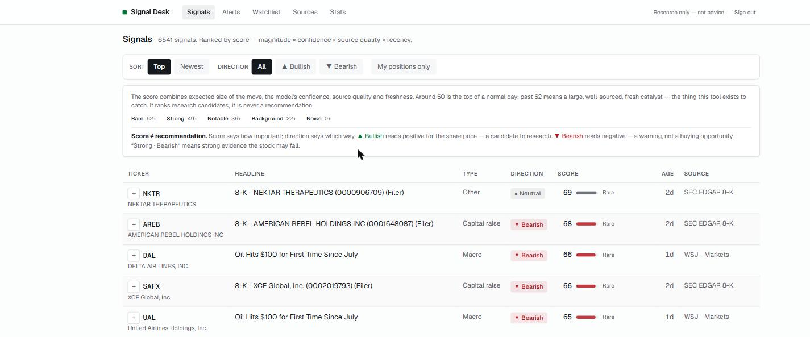
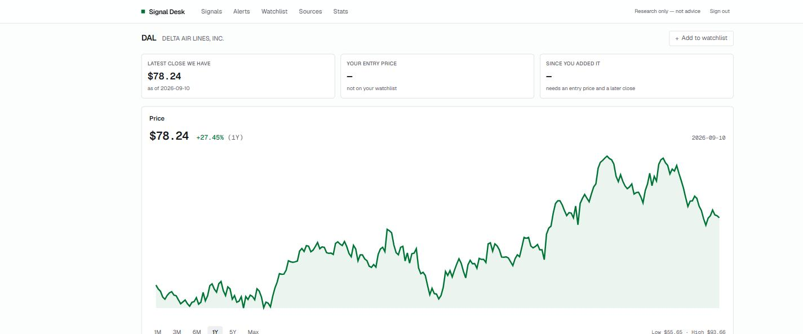
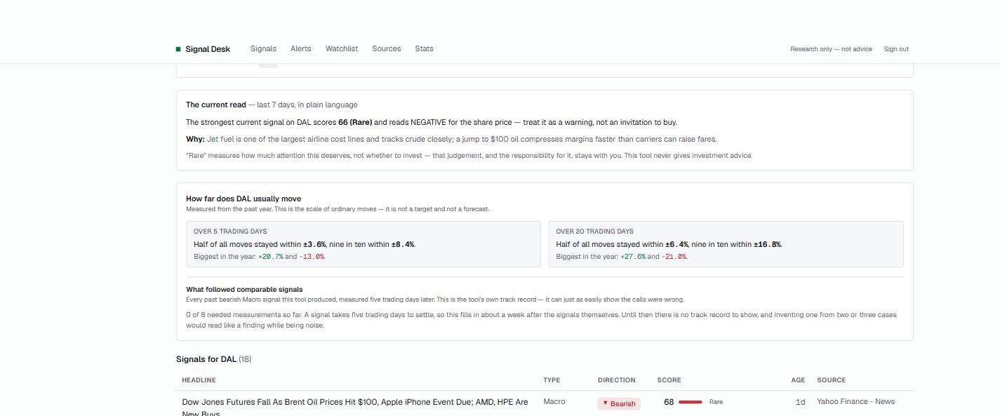
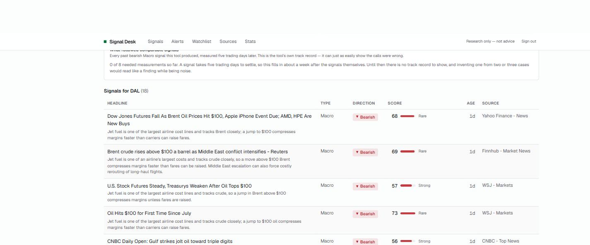

# Signal Desk

A private stock-catalyst research tool.

It polls a curated list of legitimate, ToS-compliant sources every ten minutes,
links each item to publicly traded US companies, has Claude read the underlying
document and score it as a potential catalyst, and shows a ranked feed —
then measures, afterwards, whether it was right.

**It surfaces signals for research. It never places trades, and it never gives
investment advice.** Every signal links to its source and shows the reasoning
behind it. There are no buy or sell buttons anywhere in the product.



The third and fifth rows are the case for the whole tool. *"Oil Hits $100 for
First Time Since July"* names no company; the scorer resolved it to **DAL** and
**UAL** and called both bearish, because jet fuel is one of the largest cost
lines an airline has.

---

## What it does

```
sources ──▶ scan ──▶ dedupe ──▶ triage ──▶ score ──▶ signals ──▶ alerts
  29        10 min    3 layers   Haiku      Opus      ranked      email
                                                         │
                                                         ▼
                                              outcomes: +1/+5/+20 days
                                                         │
                                                         ▼
                                                 was it right?
```

| Stage | What happens |
|---|---|
| **Scan** | Every enabled source on its own poll interval. One failing source never aborts a run; each failure is recorded per source and shown on `/sources`. |
| **Dedupe** | Three layers: canonical URL, content hash, and a token-set story key that catches the same wire story republished by several outlets. Story clustering is restricted to editorial sources — it once merged six distinct Form 4 filings into one. |
| **Triage** | Haiku answers "could this move a US-listed equity?" for about a fifth of a cent. Biased toward passing: a false negative loses a signal permanently. |
| **Score** | Opus reads the item — including the actual SEC filing text, fetched on demand — and returns structured signals: ticker or sector, event type, direction, magnitude, confidence, horizon, and a plain-language rationale. |
| **Outcomes** | Records the close at signal time and at +1, +5 and +20 trading days, then reports hit rate by event type, source, confidence bucket and prompt version. |

### Beyond the feed

- **Price charts** — 1M/3M/6M/1Y/5Y/Max with hover scrubbing, built from up to
  five years of daily closes cached locally.
- **Company pages** — plain-language description of what the company does, size
  and listing, next earnings date, and a risk panel (realised volatility,
  worst 12-month drawdown, 52-week range position).
- **Base rates** — how far this stock usually moves over 5 and 20 trading days,
  and what actually followed past signals of the same event type and direction.
- **Watchlist** — captures the price the moment you add a symbol, so the
  "since you added it" column grades *your* decisions, not the model's opinions.
  Positions can be marked **Owned**, which lowers their alert threshold and
  moves them to the front of the scoring queue.
- **Alerts** — a signal crossing the bar becomes a row on `/alerts` and, if
  email is configured, a message. Plus a daily digest after the close.
- **Stats** — hit rate by confidence bucket, event type, source and prompt
  version, with a verdict that refuses to conclude anything below ten
  measured signals.

### The company page





Base rates exist so a number has something to be judged against: a 3% move in
a stock whose ordinary five-day range is ±3.6% is not news. The panel below
them is the tool reporting that it has *no* track record yet — 0 of the 8
measurements it needs — rather than computing a hit rate from two cases and
presenting noise as a finding.



Five independent sources, one thesis, each with the reasoning that produced it.

---

## How to read the numbers

This is the part that is easiest to get wrong, so it is stated plainly.

### Score says how important. Direction says which way.

They are independent. **"Strong · Bearish" means strong evidence the stock may
fall** — a warning, not a buying opportunity. Bullish is the one worth
researching as an opportunity.

### The score is a ranking, not a percentage and not a price target

```
raw     = magnitude/5 × confidence × source weight × recency decay × 100
display = 100 × (raw / 100) ^ 0.6
```

Four factors below 1 multiply into a small number, so the raw product tops out
far below 100 in practice. The display transform is a monotonic stretch — it
cannot reorder anything — applied so the numbers are legible. Bands are read
off the measured distribution:

| Display | Band | Meaning |
|---|---|---|
| 62+ | **Rare** | Large move, high confidence, primary source, fresh. A handful a month. |
| 49+ | **Strong** | Top of a normal day. Worth opening the filing behind it. |
| 36+ | **Notable** | A real read, but second-order, less certain, or not fresh. |
| 22+ | **Background** | Context. Skim rather than act. |
| below | **Noise** | Kept for the record. |

A score of 72 says *read this today*. It does not say the stock will move 72 of
anything.

### Recency decay is recomputed on every page load

Half-lives are 36 hours (days horizon), one week, and one month. The stored
`base_score` is time-invariant; the decay is applied in SQL at query time. An
earlier version stored the decayed value and sorted on it, which meant Monday's
signal outranked Friday's forever.

### Alerts

| Rule | Threshold | Applies to |
|---|---|---|
| **Rare** | display 62+ | any symbol |
| **Your position** | display 49+ | symbols marked *Owned* |

Neutral direction never alerts — an interruption without a directional claim is
worthless. Measured against real data, the Rare bar passes about 1.7% of
directional signals: one or two a day.

---

## Honest limits

- **It will not beat algorithms on speed.** An 8-K hits EDGAR and is priced
  within a second. The edge this is built for is *interpretation* — connecting
  a tariff or a contract award to companies the headline does not name.
- **Coverage is good, not total.** Every US-listed company is legally required
  to file material events with the SEC, and those feeds are read in full. But
  paywalled scoops and social-media-driven moves without a news trigger are out
  of reach.
- **It will be confidently wrong sometimes.** How often is not knowable in
  advance — that is what `/stats` is for. Treat the first weeks as calibration,
  not as a trading system.
- **The scores are not yet validated.** Until the outcome tables have enough
  measured signals, the display bands describe a distribution, not a track
  record.

---

## Costs, measured

A full trading day, measured rather than estimated:

| | |
|---|---|
| Items collected | ~1,300/day |
| Triage (Haiku) | $0.0017 per call |
| Scoring (Opus) | $0.0238 per call, ~74% of triaged items |
| **Cost per item** | **$0.0193** |
| Unthrottled daily total | ~$25 |

`DAILY_LLM_BUDGET_USD` is a hard stop. Because it is a hard stop, **queue order
is the spending policy**: items are processed most-valuable-first — news
touching an owned position, then SEC filings, then regulators, then everything
else by source quality. A budget that covers part of a day therefore covers the
part that matters.

| Budget | Per month | Buys |
|---|---|---|
| $3/day | $90 | Owned positions + all high-value SEC filings |
| $6/day | $180 | + regulators + the best news sources |
| $25/day | $750 | Everything |

`SCORING_MODE` offers cheaper shapes: `off` (free, rules only), `watchlist`,
`haiku`, `full`.

---

## Setup

```bash
cp .env.example .env.local
npm install
npm run db:migrate
npm run db:seed
npm run sync:tickers
```

Every value is documented inline in [`.env.example`](.env.example). The ones
that matter:

| Variable | Where from |
|---|---|
| `DATABASE_URL` | Neon, via the Vercel Marketplace integration. Use the **pooled** connection string. |
| `ANTHROPIC_API_KEY` | [console.anthropic.com](https://console.anthropic.com) — needs a credit balance. |
| `MARKET_DATA_API_KEY` | [finnhub.io](https://finnhub.io), free tier (60 req/min). |
| `SEC_USER_AGENT` | No signup, but the SEC **requires** a descriptive agent with a real contact address. |
| `CRON_SECRET`, `SESSION_SECRET` | `openssl rand -hex 32`, independently. |
| `RESEND_API_KEY` | Optional. [resend.com](https://resend.com) free tier for alert email. |

Then create an account:

```bash
npm run users -- add you@example.com
```

### Two things that will bite you

**Do not put `$` in a `.env` value.** Next runs variable expansion over those
files, so `$131072` inside a password hash is read as an undefined variable and
deleted. The scrypt format here uses dots for exactly this reason. An
87-character hash arriving as 25 characters looks identical to a wrong
password.

**Environment changes need a redeploy.** Vercel injects them at deploy time.
Cron jobs failing with 500 on a correct-looking config almost always means the
running deployment predates the variable.

### Deployment

Cron needs **Vercel Pro** — Hobby is limited to daily, hour-precision
schedules. The four jobs in [`vercel.ts`](vercel.ts):

| Path | Schedule (UTC) |
|---|---|
| `/api/scan` | every 10 minutes |
| `/api/process` | 5 minutes offset, every 10 |
| `/api/prices` | 21:30, weekdays |
| `/api/outcomes` | 22:00, weekdays |

Cron invocations reach the app even with Vercel Authentication enabled — that
was verified, not assumed. Browser access from a device not logged into Vercel
does require turning it off.

---

## Operations

```bash
npm run scan                  # one ingest cycle
npm run process               # score the queue
npm run outcomes              # prices + measurement
npm run daemon                # scan + score in a loop, local stand-in for cron

npm run status                # corpus and coverage snapshot
npm run top-signals           # current top, with the score's inputs
npm run anatomy               # where the score distribution actually sits
npm run rescore               # recompute stored scores after a formula change
npm run reprocess-filings     # re-read filings that were scored without their text
npm run users                 # list / add / remove accounts
npm run alerts                # flush pending alert email by hand
```

---

## Development

```bash
npm run dev
npm run typecheck
npm run test
npm run build
```

Tests cover the scoring formula and its display transform, recency decay,
the SQL/TypeScript decay agreement, dedupe hashing, ticker matching, the
prefilter, session and password handling, EDGAR document selection, and
source-seed integrity.

Fixtures in `fixtures/` carry `expected` blocks that double as scorer
assertions — including a contract-win injection test, a tariff
split-direction test, and a beat-and-lower test, which is the most common way
a headline-reading scorer gets direction exactly backwards.

---

## Architecture notes

Decisions that are not obvious from the code, and the reasons they are the way
they are.

- **`prices.market_date` is a `date`, not a timestamp.** As a timestamptz, two
  rows for the same day differing by a millisecond both satisfied the primary
  key, inventing a phantom trading day and permanently desyncing the +1/+5/+20
  offsets for that symbol.
- **Every failed price fetch is recorded.** Without that record, a failed fetch
  is bit-for-bit identical to a market holiday, and "+5 trading days" silently
  measures the wrong date. Outcomes refuse to finalise across an unresolved gap.
- **`signals` uses `UNIQUE NULLS NOT DISTINCT`.** Without it, every
  sector-level signal — the second-order reads this tool exists for —
  duplicates on every reprocess.
- **Source weight is compressed onto 0.65–1.0, not applied raw.** The scoring
  prompt already tells the model to lower confidence for rumours, so applying
  provenance linearly charged the same story twice.
- **EDGAR filings are fetched at score time, not ingest time.** The feed carries
  only a form type and a byte count; scoring a merger from
  `425 - SYSCO CORP … Size: 974 KB` is scoring a filename. The complete
  submission `.txt` is deliberately not used — it concatenates exhibits, so one
  filing opened on 900 KB of unrelated credit-agreement boilerplate.
- **The model failing does not stop the pipeline.** An exhausted account or
  revoked key disables model calls for the rest of the run and falls back to
  rules, with the reason recorded on the run row.

---

## Security

- No secret is prefixed `NEXT_PUBLIC_`, so none reach the client bundle.
- `/api/*` requires `Authorization: Bearer $CRON_SECRET` and fails **closed** —
  a missing or too-short secret returns an error, never an open endpoint.
- The dashboard is deny-by-default: `src/proxy.ts` protects everything except
  the login route, so a page added later is protected without anyone
  remembering to protect it.
- Passwords are scrypt at OWASP parameters, per user, with an eight-attempt
  lockout. Sign-in runs a verification even for unknown addresses so response
  time does not reveal which accounts exist.
- Feed URLs come only from server-side config, never user input, so the fetcher
  is not an SSRF surface.
- No source is scraped and no anti-bot control is circumvented. Stooq was
  dropped as a price-history provider for exactly that reason.
